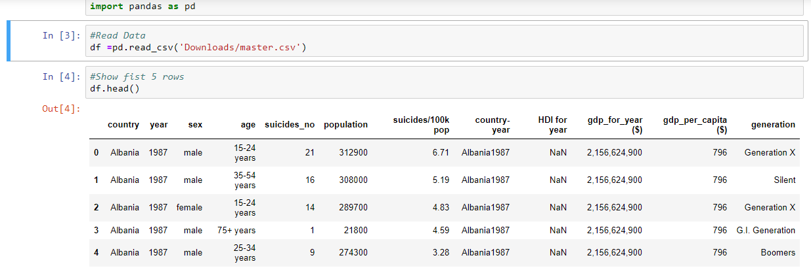
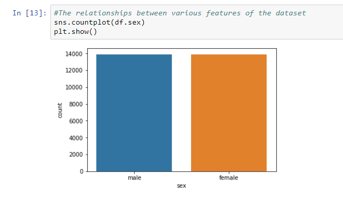
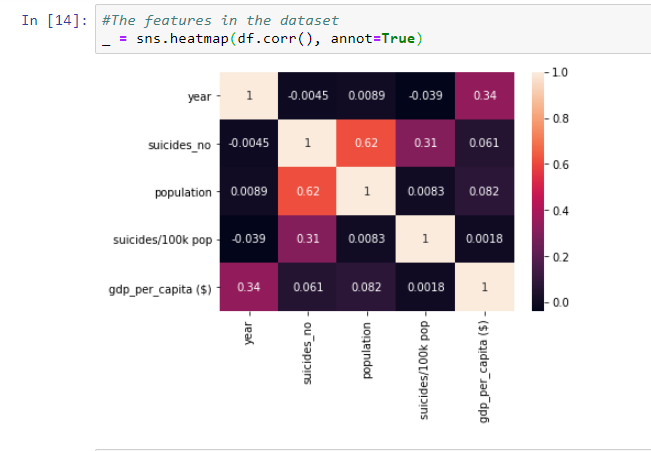
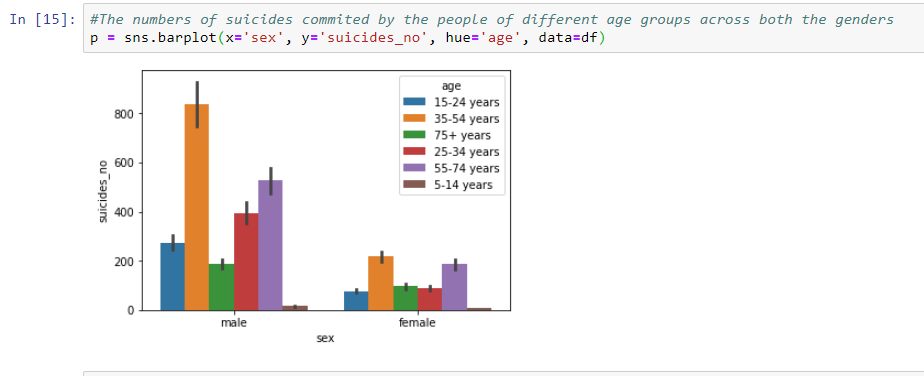
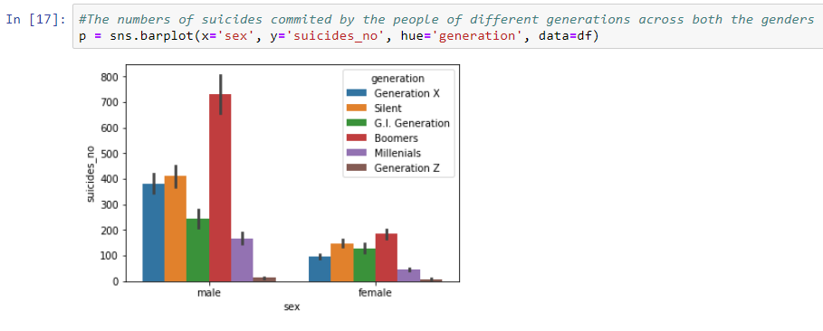
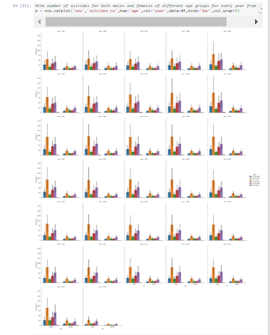
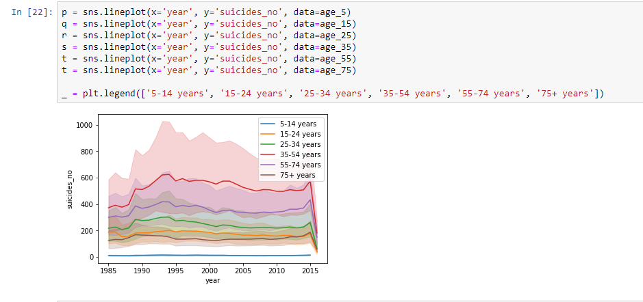
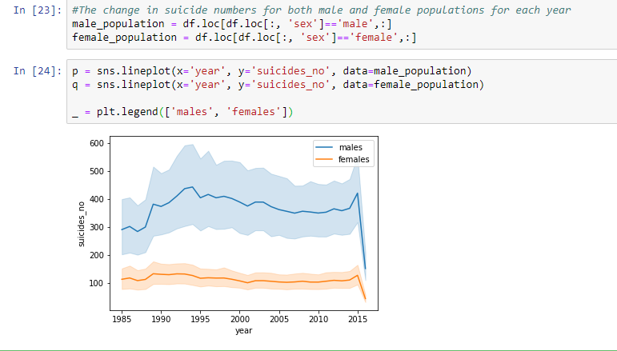

## Examine the rate at which suicide is commited

Suicide rates are decreasing globally of those countries that show clear linear trends over time, 2/3 are decreasing on average, suicide rate increases with age. This remains true when controlling for continent in the Americas, Asia & Europe, but not for Africa & Oceania. 

There is a weak positive relationship between a countries GDP (per capita) and suicide rate the highest suicide rate ever recorded in a demographic (for 1 year) is 225 (per 100k population).
There is an overrepresentation of men in suicide deaths at every level of analysis (globally, at a continent and country level). Globally, the male rate is ~3.5x higher. Africa has very few countries providing suicide data.

Interesting to see that more suicides per 100k occur in older ages and decreases with age too. It's true for both female and males. This may be due to suicides diluting into a bigger population, makes sense because as people get older the more they die so there are few left to commit suicide. This, plus a tendency to commiting suicide, it reflects on the proportion.

I observe from the dataset that -

  * Total 101 unique countries are present in dataset
  * The age feature has 6 unique age groups
  * The generation feature has 6 types of generation
  * Generation X has higher rates of suicide
  * Suicide rates are higher in Russian Federation, United States and Japan
  * Suicide rates are too low in many countries.
  * Suicide rates are moderate in France, Ukraine, Germany, Brazil, Republic of Korea, Poland, Thailand,     United Kingdom, Canada, Italy, Mexico, etc.
  * <b>The Greatest Generation</b>: Born between 1901 - 1924, they are those who experienced the Great Depression and World War II in their adulthood.
  * <b>The Silent Generation</b>: Born in between 1924 - 1945, coming of age during the postwar happiness.The Silent Generation children grew up in conditions complicated by war and economic downturn.
  * <b>Baby Boomers</b>: Those born in the years after World War II. These are the men and women who tuned in,got high, dropped out, dodged the draft, swung in the Sixties and became hippies in the Seventies. The first tolerant generation. Envision technology and innovation as requiring a learning process.
  * <b>Generation X</b>: Born between 1965 and 1980, they are the “latch-key kids” who grew up street-smart but isolated, often with divorced or career-driven parents.
  * <b>Millennials</b>: Researchers and commentators use birth years ranging from the early 1980s to the early 2000s. Known as sophisticated, technology wise, immune to most traditional marketing and sales pitches,they’ve seen it all and been exposed to it all since early childhood.
  * <b>Generation Z</b>: It is the generation born after 1995 and they have never known a world without computers   and cell phones.


* <b>Loading the Dataset</b>: The dataset used is a collection of Suicide datasets and can be found [here](https://www.kaggle.com/russellyates88/suicide-rates-overview-1985-to-2016) – download it. Once you have downloaded the dataset, open your jupyter notebook and let’s get to work. Our first step is to load in the data using pandas read_csv function.

```python
import pandas as pd
df = pd.read_csv('master.csv')
```


* <b>Cleaning the Dataset</b>: Observing the dataframe, we will notice how we have 2/3 of HDI missing. We will drop <b>"HDIForYear"</b> and <b>"CountryYear"</b> because they’re not useful for our visualization. 

```python
#Drop the columns not needed
df.drop(["HDI for year",'country-year'],inplace=True,axis=1)
```

## Data Visualization 

Now we will plot some graphs to explore the relationships between various features of the dataset

* Firstly, we will plot a graph to see that the dataset includes equal amount of data for both genders

```python
p = sns.countplot(x="sex", data=df)
```



* Secondly, we will show the correlations between the features in the dataset

```python
_ = sns.heatmap(df.corr(), annot=True)
```



* Thirdly, we will show the numbers of suicides commited by the people of different age groups across both the genders. We can observe that the suicide rate is higher in the age group of 35-54 years in both female and male populations and it is lowest in age group of 5-14 years

```python
p = sns.barplot(x='sex', y='suicides_no', hue='age', data=df)
```



* The plot shows the numbers of suicides commited by the people of different generations across both the genders. Here, we can see that suicide numbers are higher in the generation of Boomers, whereas it is lowest in Generation Z.

```python
p = sns.barplot(x='sex', y='suicides_no', hue='generation', data=df)
```


* The plot shows the number of suicides for both males and females of different age groups for every year from 1985 to 2016. <b>Note:</b>You can decrease the col_wrap to 3 or 2 if you want to see the graph very well.

```python
p = sns.catplot('sex','suicides_no',hue='age',col='year',data=df,kind='bar',col_wrap=5)
```


* The plot shows the change in suicide numbers for people of different age groups for every year

```python
age_15 = df.loc[df.loc[:, 'age']=='15-24 years',:]
age_35 = df.loc[df.loc[:, 'age']=='35-54 years',:]
age_75 = df.loc[df.loc[:, 'age']=='75+ years',:]
age_25 = df.loc[df.loc[:, 'age']=='25-34 years',:]
age_55 = df.loc[df.loc[:, 'age']=='55-74 years',:]
age_5 = df.loc[df.loc[:, 'age']=='5-14 years',:]
```
```python
p = sns.lineplot(x='year', y='suicides_no', data=age_5)
q = sns.lineplot(x='year', y='suicides_no', data=age_15)
r = sns.lineplot(x='year', y='suicides_no', data=age_25)
s = sns.lineplot(x='year', y='suicides_no', data=age_35)
t = sns.lineplot(x='year', y='suicides_no', data=age_55)
t = sns.lineplot(x='year', y='suicides_no', data=age_75)

_ = plt.legend(['5-14 years', '15-24 years', '25-34 years', '35-54 years', '55-74 years', '75+ years'])

```


* The plot shows the change in suicide numbers for both male and female populations for each year
```python
male_population = df.loc[df.loc[:, 'sex']=='male',:]
female_population = df.loc[df.loc[:, 'sex']=='female',:]
```
```python
p = sns.lineplot(x='year', y='suicides_no', data=male_population)
q = sns.lineplot(x='year', y='suicides_no', data=female_population)

_ = plt.legend(['males', 'females'])
```
